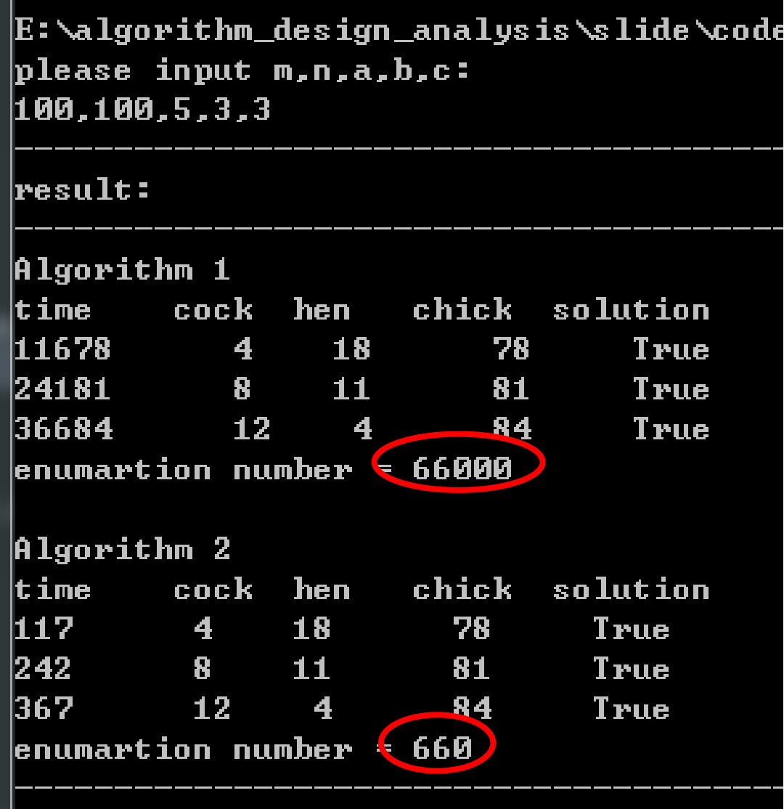
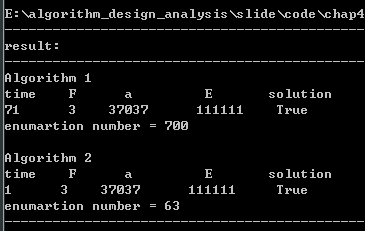
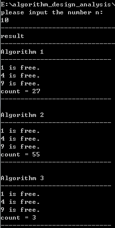

---

<div class="logo-fixed">
  
</div>

<div style="text-align: center; font-size: 30px; font-weight: bold;">

# 内容提要

</div>

<div style="display: flex; justify-content: center; align-items: center; height: 100%; font-size: 20px; flex-direction: column;  text-align: left;">

### 第4章 基本的算法策略

- 4.1 迭代算法
- <span style="color: red"> 4.2 蛮力法 </span>
- 4.3 分而治之算法
- 4.4 贪婪算法
- 4.5 动态规划
- 4.6 算法策略间的比较

</div>

---

<div class="logo-fixed">
  
</div>

<div style="text-align: center; font-size: 30px; font-weight: bold;">

# 4.2 蛮力法

</div>

<div style="font-size: 20px; text-align: left;">

蛮力法

- ※基本思想：利用计算机运算速度快这一特性，在解决问题时采取的一种“懒惰”的策略

- ※基本方法：不经（经过较少的）问题的所有情况或所有过程交给计算机去一一尝试，从中找出问题的解

- ※应用范围：选择排序、冒泡排序、插入排序、顺序查找、朴素的字符串匹配等

- ※常用的方法：
- &emsp; ✔枚举法（本节）
- &emsp; ✔盲目搜索法（第五章）

</div>

---

<div class="logo-fixed">
  
</div>

<div style="text-align: center; font-size: 30px; font-weight: bold;">

# 4.2.1 枚举法

</div>

<div style="text-align: left; font-size: 20px;">

### 枚举法(enumerate)（穷举法）

- ※基本思想：根据问题条件<span style="color: red;">列出</span>所有<span style="color: red;">可能情况</span>，<span style="color: red;">逐一尝试</span>找到满足问题条件的解。解空间很大时要排除部分不合理情况

- ※基本步骤：
- &emsp; ✔找出枚举范围：分析问题所涉及的各种情况。
- &emsp; ✔找出约束条件：分析问题的解需要满足的条件，并用逻辑表达式表示。

</div>

---

<div class="logo-fixed">
  
</div>

<div style="text-align: center; font-size: 30px; font-weight: bold;">

# 4.2.1 枚举法

</div>

<div style="text-align: left; font-size: 20px;">

<span style="color: red;"> 例1：百钱百鸡问题 </span>

- 中国古代数学家张丘建在他的《算经》中提出了著名的“百钱百鸡问题”：鸡翁一，值钱五；鸡母一，值钱三；鸡雏三，值钱一；百钱买百鸡，翁、母、雏各几何？

</div>

<div style="display: flex; align-items: flex-start; gap: 30px; height: 100%;">
  
  <div style="flex: 1; font-size: 17px; text-align: left;">

    算法设计1：
    1）三元一次不定方程：
    2）枚举策略：
       枚举范围：
       公鸡x: 1 ~ 20
       母鸡y: 1 ~ 33
       鸡雏z: 1 ~ 100
       约束条件：
           x + y + z = 100
           5x + 3y + z / 3 = 100

  </div>
  
  <div style="flex: 1;">

```cpp
main() {
    int x, y, z;
    for (x = 1; x <= 20; x++) {
        for (y = 1; y <= 33; y++) {
            for (z = 1; z <= 100; z++) {
                if (100 == x + y + z && 100 == 5 * x + 3 * y + z / 3 && z % 3 == 0) {
                    print(x, y, z);
                }
            }
        }
    }
}
```

<span style="color: red; font-size: 20px"> 枚举规模：20 * 33 * 100 = 66000 </span>

</div></div>

---

<div class="logo-fixed">
  
</div>

<div style="text-align: center; font-size: 30px; font-weight: bold;">

# 4.2.1 枚举法

</div>

<div style="display: flex; gap: 30px; align-items: flex-start; height: 100%;">

  <div style="flex: 1; font-size: 20px; text-align: left;">
    
    算法设计2：
    枚举范围：
        公鸡x: 1 ~ 20
        母鸡y: 1 ~ 33
        鸡雏z: 100 - x - y
        约束条件：
            5x + 3y + z / 3 = 100

<div style="display: flex; justify-content: flex-start; padding-left: 50px;">
  
</div>

  </div>

  <div style="flex: 1;">

```cpp
main( ) {  
    int x,y,z;    
    for(x = 1; x <= 20; x = x + 1)   
        for(y = 1; y <= 33; y = y + 1)
        { 
            z = 100 - x - y;
            if(z % 3 == 0 && 100 == 5 * x + 3 * y + z / 3)                
                print(x, y, z);
        }
}
```
<span style="color: red; font-size: 20px"> 枚举规模：20 * 33 = 660 </span>

</div></div>

---

<div class="logo-fixed">
  
</div>

<div style="text-align: center; font-size: 30px; font-weight: bold;">

# 4.2.1 枚举法

</div>

<div style="display: flex; gap: 30px; align-items: flex-start; height: 100%;">

  <div style="flex: 1; font-size: 20px; text-align: left;">

    例2：解数字迷

<table style="border-collapse: collapse; text-align: right; margin: 0 auto;">

<tr>
    <td></td><td>A</td><td>B</td><td>C</td><td>A</td><td>B</td>
</tr>

<tr>
    <td style="text-align: left;">×</td>
    <td></td><td></td><td></td><td></td><td>A</td>
</tr>

<tr>
    <td colspan="10" style="border-bottom: 2px solid black;"></td>
</tr>

<tr>
    <td>D</td><td>D</td><td>D</td><td>D</td><td>D</td><td>D</td>
</tr>
</table>

    算法设计1：
    1）按乘法枚举：
    2）枚举范围：
       A: 3 - 9 (A = 1, 2时积不会得到六位数)
       B: 0 - 9
       C: 0 - 9

  </div>

  <div style="flex: 1; font-size: 20px;">

    约束条件：
    1.先求五位数与A的积
    2.再测试积的各位是否相同
    3.若相同则找到了问题的解
	
    积的各位是否相同的方法：
    1.从低位开始，每次都取数据的个位，
    2.然后整除10，使高位的数字不断变成个位，并逐一比较。

<span style="color: red; font-size: 20px"> 枚举规模：共尝试7 * 10 * 10 = 700次</span>

</div></div>

---

<div class="logo-fixed">
  
</div>

<div style="text-align: center; font-size: 30px; font-weight: bold;">

# 4.2.1 枚举法

</div>

```cpp
main（ ）
{   
    int A, B, C, D, E, E1, F, G1, G2, i;
    for(A = 3; A <= 9; A ++)
        for(B = 0; B <= 9; B ++)
            for(C = 0; C <= 9; C ++)
            {    
                F = A * 10000 + B * 1000 + C * 100 + A * 10 + B;
                E = F * A；E1 = E;  G1 = E1 mod 10;
                for(i = 1; i <= 5; i ++)
                {     
                    G2 = G1; 
                    E1 = E1 / 10;     
                    G1 = E1 mod 10;
                    if(G1 <> G2 ) break;    
                }
                if(i = 6) print( F，”*”，A，”=”，E);
           }
}
```

---

<div class="logo-fixed">
  
</div>

<div style="text-align: center; font-size: 30px; font-weight: bold;">

# 4.2.1 枚举法

</div>

<div style="display: flex; gap: 30px; align-items: flex-start; height: 100%;">

  <div style="flex: 1; font-size: 20px; text-align: left;">

算法设计2：<span style="color: red;"> DDDDDD / A = ABCAB </span>

    枚举范围：
        A: 3 - 9（A = 1, 2时积不会得到六位数）
        D: 1 - 9
    约束条件：
        商的万位、十位与除数相同，
        千位与个位相同，都相同时为解。

  <div style="display: flex; justify-content: flex-start; padding-left: 50px;">
    
  </div>

  </div>

  <div style="flex: 1; font-size: 20px;">

```cpp
main（）
{
    int A, B, C, D, E, F;
    for(A = 3; A <= 9; A ++)
        for(D = 1; D <= 9; D ++) 
        { 
            E = D * 100000 + D * 10000 + D * 1000 + D * 100 + D * 10 + D;
            if(E mod A = 0) F = E \ A;
            if(F \ 10000 = A and (F mod 100) \ 10 = A)
                if(F \ 1000 mod 10 = F mod 10)
                    print(F，”*”，A，”=”，E);
        }
}
```
<span style="color: red; font-size: 20px"> 枚举规模：共尝试7 * 9 = 63次</span>

</div></div>

---

<div class="logo-fixed">
  
</div>

<div style="text-align: center; font-size: 30px; font-weight: bold;">

# 4.2.2 其他范例

</div>

<span style="color: red; font-size: 20px"> 例1：狱吏问题 </span>

<div style="font-size: 20px; text-align: left;">

    n间锁着的牢房，狱吏通过牢房n次：
    ✔每通过一次，按所定规则转动n间牢房中的某些门锁,
    ✔每转动一次：原来锁着的被打开, 原来打开的被锁上；
    ✔通过n次后，门锁开着的，牢房中的犯人放出，否则犯人不得获释。

    转动门锁的规则：
    ✔第一次通过牢房，要转动每一把门锁，即把全部锁打开；
    ✔第二次通过牢房时，从第二间开始转动，每隔一间转动一次；
    ✔第k次通过牢房，从第k间开始转动，每隔k - 1间转动一次；

<div style="text-align: center; color: red">问通过n次后，那些牢房的锁仍然是打开的？</div>

</div>

---

<div class="logo-fixed">
  
</div>

<div style="text-align: center; font-size: 30px; font-weight: bold;">

# 4.2.1 枚举法

</div>

<div style="display: flex; gap: 30px; align-items: flex-start; height: 100%;">

  <div style="flex: 1; font-size: 20px; text-align: left;">

    算法设计1：
    1） 数组a[n]记录锁的状态，1：锁，0：开
    2） 开/关锁：a[i] = 1 - a[i]
    3） 转动序号：
        第1次: 1,2,3,…,n
        第2次: 2,4,6,…
        第i次：i,2i,3i,…
    4） 蛮力法模拟开关锁过程，a[i] = 0是释放i

</div>

  <div style="flex: 1; font-size: 20px;">

```cpp
main( )
{  
    int * a, i, j, n;
    input(n);
    a = calloc(n + 1, sizeof(int));
    for(i = 1; i <= n; i ++)
      a[i] = 1;
    for(i = 1; i <= n; i ++)
        for(j = i; j <= n; j = j + i)
            a[j] = 1 - a[j];
    for (i = 1; i <= n; i ++)
        if(a[i] = 0)     
            print(i,”is  free.”);
}

```

<span style="color: red; font-size: 20px"> O(1 + 1 / 2 + 1 / 3 + …… + 1 / n) = O(nlogn) </span>

</div></div>

---

<div class="logo-fixed">
  
</div>

<div style="text-align: center; font-size: 30px; font-weight: bold;">

# 4.2.1 枚举法

</div>

<div style="display: flex; gap: 30px; align-items: flex-start; height: 100%;">

  <div style="flex: 1; font-size: 20px; text-align: left;">

    算法设计2：
    转动门锁的规则可以有另一种理解:
    ✔第一次转动的是编号为1的倍数的牢房；
    ✔第二次转动的是编号为2的倍数的牢房；
    ✔第三次转动的是编号为3的倍数的牢房；
    则狱吏问题是一个关于因子个数的问题。
<span style="color: red; font-size: 20px"> 若因子个数为奇数，牢房打开，否则关闭。</span>

</div>

  <div style="flex: 1; font-size: 20px;">

```cpp
main( )
{  
    int s, i, j, n;
    input(n);
    for(i = 1; i <= n; i ++)
    {  
        s = 1;
        for(j = 2; j <= i; j = j ++)
        if(i mod j = 0) s = s + 1;
        if(s mod 2 = 1) print(i,”is  free.”); 
   }
}

```
<span style="color: red;"> O(1 + 2 + 3 + …… + n) = $O(n^2 / 2)$ </span>

</div></div>

---

<div class="logo-fixed">
  
</div>

<div style="text-align: center; font-size: 30px; font-weight: bold;">

# 4.2.1 枚举法

</div>

<div style="display: flex; gap: 5px; align-items: flex-start; height: 100%;">

  <div style="flex: 1; font-size: 20px; text-align: left;">

    算法设计3：

    编号与因数个数的关系 	
    n    1  2  3  4  5  6  7  8  9  10   11  12  13  14
    d(n) 1  2  2  3  2  4  2  4  3   4    2   6   2   4
     
    数学模型：
    ✔当前仅当n为完全平方数时,d(n)为奇数；
    ✔n的因子是成对出现的,也即当n = a * b且a ≠ b时，必有两个因子a，b; 
    ✔只有n为完全平方数，也即当n = a ^ 2时, 才会出现d(n)为奇数的情形。

</div>

  <div style="flex: 1; font-size: 20px;">

```cpp
main( )
{ 
    int i, n;
    input(n);
    for(i = 1; i <= sqrt(n); i ++)
        if(i * i <= n) print(i*i,”is free.”);
        else break;
}
```

<span style="color: red">$O(\sqrt{n})$</span>

</div></div>

---

<div class="logo-fixed">
  
</div>

<div style="text-align: center; font-size: 30px; font-weight: bold;">

# 4.2.1 枚举法

</div>

<div style="display: flex; gap: 30px; align-items: flex-start; height: 100%;">

  <div style="flex: 1; font-size: 20px; text-align: left;">

<div style="display: flex; justify-content: flex-start; padding-left: 100px;">
    
</div>

  </div>

  <div style="flex: 1; font-size: 20px; display: flex; flex-direction: column; justify-content: center; align-items: center; color: blue; margin-top: 50px;">
     
    n = 10

    算法1：O (nlogn)       27次 
    
    算法2：O (n^2)         55次
    
    算法3：O (n^0.5)        3次
    
</div></div>